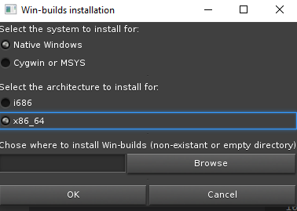
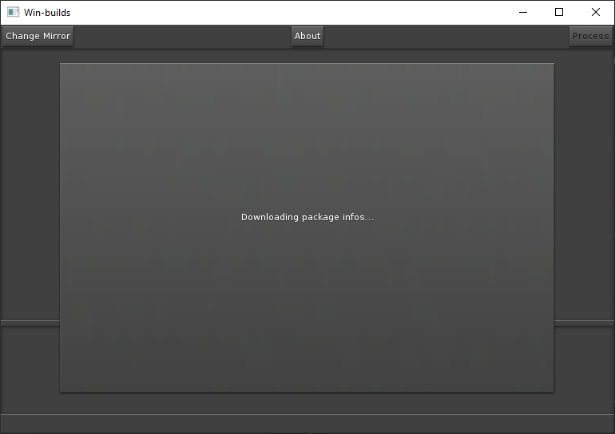
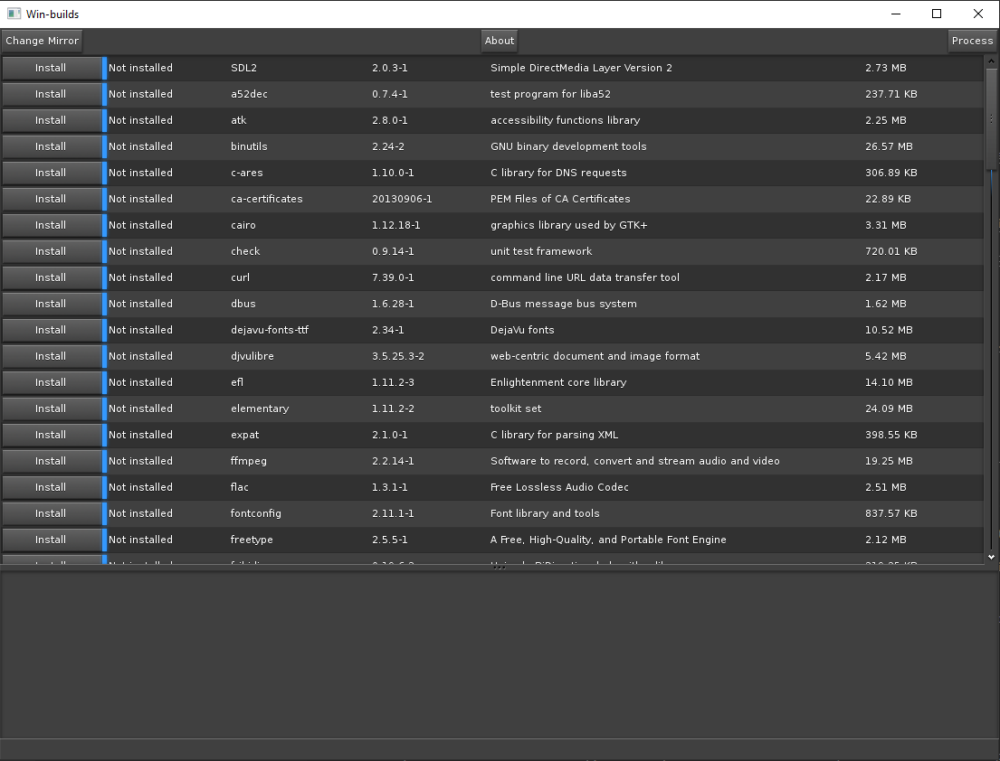
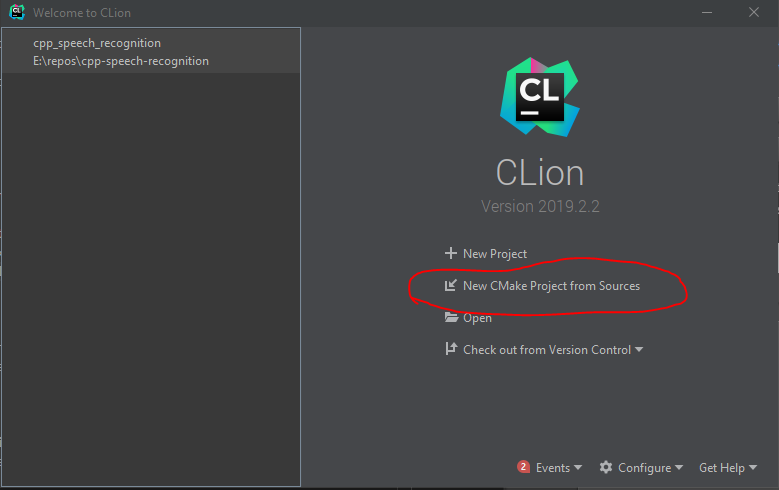
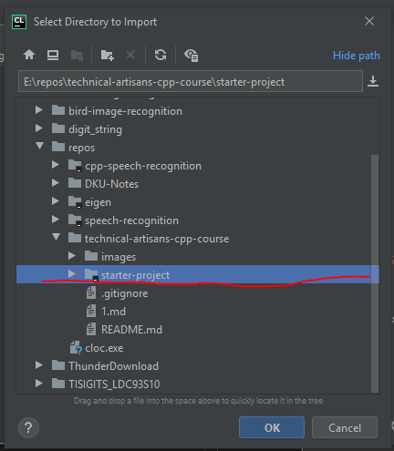
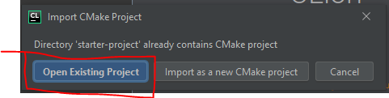

# C/C++ Introduction: Overview & Environment Configurations

## Coursera Course

[Coursera Link](https://www.coursera.org/programs/duke-university-courses-gp9dy?authProvider=duke)

## Resources for This Course

All course-related resources are on a [GitHub Repository](https://github.com/tjysdsg/technical-artisans-cpp-course).

You can download it via [link](https://github.com/tjysdsg/technical-artisans-cpp-course/archive/master.zip), however, when an update comes up, you won't see it in your local files.

When we later talk about `git`, your are gonna clone this repository and use `git pull` to receive any updates. For now, you can just download the resources you need.

If interested in starting to learn `git` in advance, check out this [tutorial](https://www.atlassian.com/git/tutorials) and its official [documentation](https://git-scm.com/docs/gittutorial).

## Environment Setup

### Prerequisite for Windows: win-builds

For macos users, please refer to [Prerequisite for macos](#prerequisite-for-macos).

- [Download this](http://win-builds.org/doku.php/download_and_installation_from_windows)
- Choose the following: 
  - . 
  - For path to install, use an empty directory that you are gonna remember. It is highly recommanded NOT to use a path that contains Chinese/Other characters, space or any other special characters.
- Wait for this to complete: 
- Click Process:  
  - Although we are not going to use most of the things that it installs, you'd better to install them all just to be safe.
- Wait for it to complete. If the downloading process is slow, try using VPN.

### Prerequisite for macos

**TODO: screenshots needed**

- First use Command+Space, and type terminal and press enter to open up a terminal.
- Type `cc` and enter.
- It will prompt you that you havn't installed development tools. If you cannot find the popup window, then you have already satisfied the requirements, skip the following.
- Just click OK all the way through, it will help you install required C/C++ toolchains.

## IDE (Interactive Development Environment)

For a more convenient and enjoyable C++ programming experience, we are gonna use [CLion](https://www.jetbrains.com/clion/) by JetBrains to write our code. Feel free to use other IDEs that you are familiar with.

**TODO: how to apply for student license**
Your DKU/Duke email account can provide free license for CLion which is extremely helpful. Register using your @duke.edu or @dukekunshan.edu.cn email address, and download CLion via [JetBrains License](https://account.jetbrains.com/licenses)

After installation, all tools for C++ development should be installed, if not, feel free to ask for help.

### For Those Who Struggles

If you are really struggling to install win-builds on Windows, try use [Dev-C++](https://sourceforge.net/projects/orwelldevcpp/). However, it does NOT use the build system `CMake` that CLion uses. Therefore, you are NOT going to have to chance to practice using CMake in the future learning.

Likewise, the alternative for macos users is [XCode](https://developer.apple.com/xcode/). However, again it does NOT use `CMake`, and its main purpose is to develop macos and iOS specific apps. Therefore, it is quite an overkill to use it for C/C++ programming (and it's quite large, several GBs).

## Starter Project

For convenience, I have provided a simple [starter-project](starter-project) for you.

To use it, do the following:

1. Duplicate the whole directory, so that you can use it next time you wanna create a new project.
2. Open up CLion, if it has opened a previous project before, it probably is gonna automatically open it. In this case, use `File -> Close Project` to close the previous project.
3. Click `New CMake Project from Sources` 
4. Navigate to the location of `starter-project` and click `OK` 
5. Click `Open Existing Project` 

To run the starter project:
1. 
